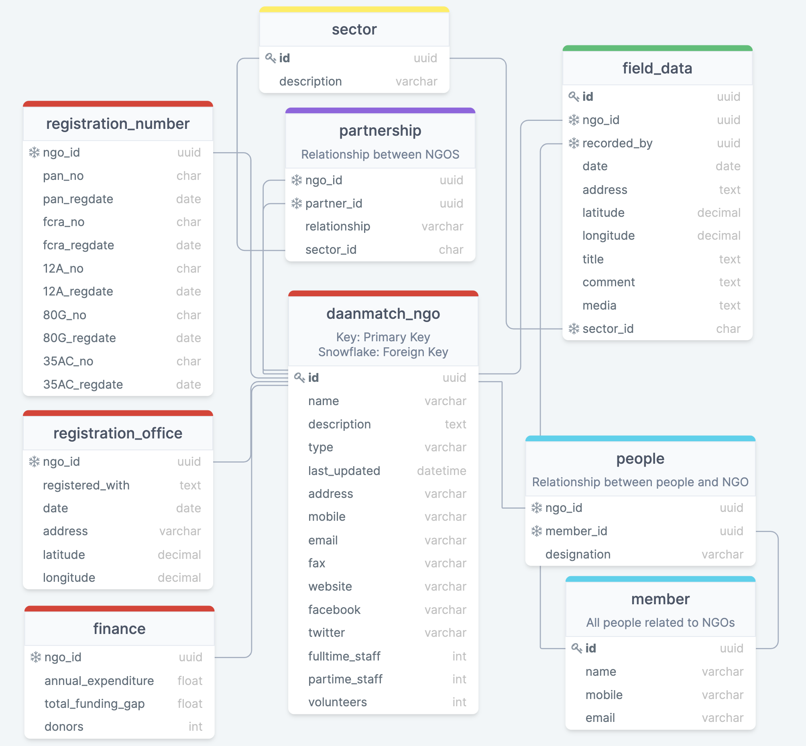

# Database - w3

## 📅 [Team Meeting - 24 Feb 2022 6:45pm PST](https://us02web.zoom.us/j/4833516577?pwd=emgvY2xnSEF5Zlh4Si9kVkx3S0dzZz09)

### Agenda

1. Short EDA presentation
2. AWS RDS Setup
3. Connection to MySQL WorkBench
4. TODOs
5. Questions

## This Week's Objective

Get familiar with AWS RDS and MySQL.

:::{admonition} What is AWS RDS?
:class: tip, dropdown
[Amazon Relational Database Service (Amazon RDS)](https://aws.amazon.com/rds/) makes it easy to set up, operate, and scale a relational database in the cloud. It provides cost-efficient and resizable capacity while automating time-consuming administration tasks, such as hardware provisioning, database setup, patching, and backups.
:::

:::{admonition} What is MySQL?
:class: tip, dropdown
[MySQL](https://www.talend.com/resources/what-is-mysql/) is a relational database management system (RDBMS) developed by Oracle that is based on structured query language (SQL). A database is a structured collection of data. It may be anything from a simple shopping list to a picture gallery or a place to hold the vast amounts of information in a corporate network.
:::

## DaanMatch's Data Model

:::{figure-md} Data-Model
:class: myclass

DaanMatch's Data Model visualized using DrawSQL. Last updated Feb 21 2022.  
Changed id datatype from int to uuid. Redefined relationships.
:::

:::{admonition} What is UUID?
:class: tip, dropdown
[Universally Unique Identifiers, or UUIDS](https://www.educba.com/mysql-uuid/), are 128 bit numbers, composed of 16 octets and represented as 32 base-16 characters, that can be used to identify information across a computer system.
:::

## Model Assignment

✅ **TODO:** [Create a Model](https://dev.mysql.com/doc/workbench/en/wb-getting-started-tutorial-creating-a-model.html)

- **Arthi:** registration_number, registration_office
- **Emily:** finance, partnership
- **Apoorv:** people, member

✅ **TODO:** [Export EER Script and .mwb file](https://stackoverflow.com/questions/9609152/how-to-print-large-erd-diagrams-done-in-mysql-workbench#:~:text=Open%20your%20ERD%20and%20then,JPEG%20if%20you%20want%20to.) and onto data-model repository in folder [shpg-2](https://github.com/DaanMatch/data-model/tree/main/shpg-2) (example in folder).

## Monthly 1-1 Meetings

✅ **TODO:** [Schedule monthly 1-1 meeting](https://www.when2meet.com/?14683494-ODlVL) with Patrick.

## Resources ℹ️

- [DS Discovery Scheduling](https://docs.google.com/spreadsheets/d/1uwpQJ0VeinKC-fPI7-ZN-RinID5Y0VamjWiwza7-otY/edit#gid=1395204760)
- [Codebook Documentation](https://github.com/DaanMatch/Codebook)
- [Data Model](https://github.com/DaanMatch/ngodata/tree/main/Data%20Model)
- [Webscrapers](https://github.com/DaanMatch/webscrape)
